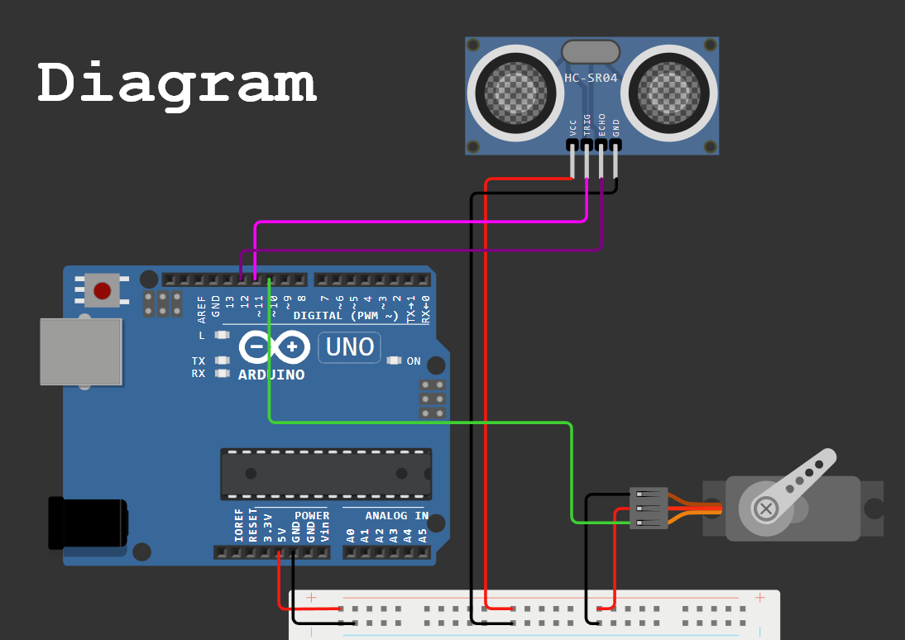
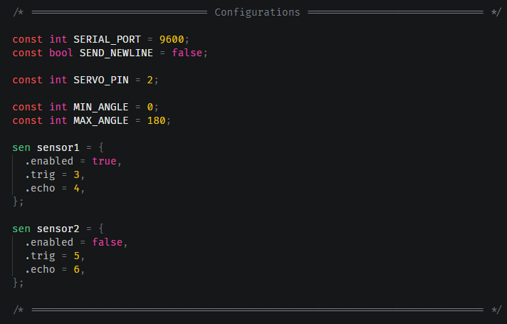
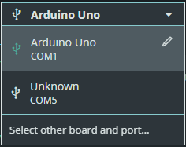
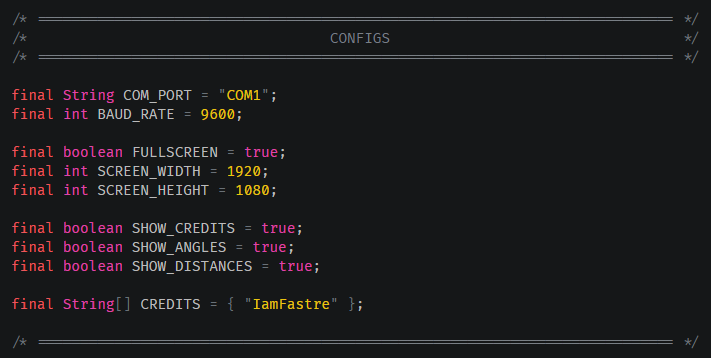

# Arduino Radar (Actually Sonar)

A simple radar system using the *Arduino Uno*, a *servo motor*, and one (or two) *ultrasonic sensor* (*HC-SR04*).
The radar scans the environment, measures distances, and visualizes the data in real-time using **Processing**.

## Circuit Diagram

Needed components:
- Arduino Uno R3/R4
- 2 Ultrasonic Sensor HC-SR04 *(or just one\*)*
- 1 Servo Motor
- Breadboard *(optional\*)*
- Patience

  
  

    <i>
      Through <a href="https://www.tinkercad.com/dashboard">Tinkercad</a>
    </i>
  

## Instructions

<ol>
  <li>Build the circuit.</li>
  <li>Configure the code in <code>ArduinoRadar.ino</code> as you wish.</li>
  
  <li>Upload <code>ArduinoRadar.ino</code> to your Arduino board.</li>
  <li>Take note of the selected Arduino port.</li>
  
  <li>Open <code>GUI/RadarGUI.pde</code> in the <a href="https://processing.org/">Processing IDE</a>.</li>
  <li>Modify the configs in <code>RadarGUI.pde</code> to match your use case.</li>
  
  <li>Run the <strong>Processing</strong> sketch to visualize the radar data.</li>
</ol> 

## Arduino Code

The Arduino code is located in `ArduinoRadar/ArduinoRadar.ino`. \
This code controls the *servo motor* to rotate the *ultrasonic sensor* and measure distances, sending the data to the serial port for **Processing** to read.

## Processing Code

The Processing code is in the `GUI` folder. \
The files include:

- `Assets/OCRAExtended-30.vlw`: Font file used by the **Processing** sketch.
- `RadarGUI.pde`: Main **Processing** code for visualizing radar data.

---

### Acknowledgments

This project is based on a tutorial from [How To Mechatronics](https://howtomechatronics.com/projects/arduino-radar-project/) by [Dejan](https://howtomechatronics.com/author/howtom12_wp/).
